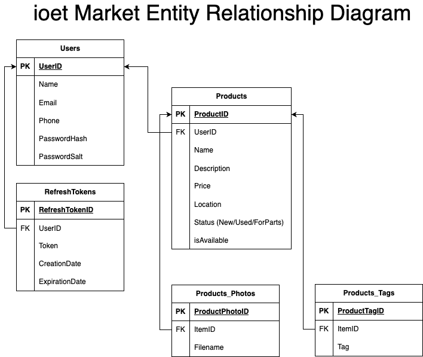

# Backend Course

## Entity Relationship Diagram

After understanding the business rules, one of the next steps for the design of a backend application is the design of the data structure that will contain the persistent information of the system. In this case it has been decided to use a relational database. You can see the Entity Relationship Diagram below.



You can also refer to the Hand-on Database ERD video, which explains the making of this diagram.

[Hand-on Database ERD](https://www.notion.so/ioet/Hands-on-Database-ERD-9118e93dffee48f69e987968f7fa350d)

## App structure

```Txt
📦backend
 ┣ 📂app                          This folder contains the application logic and is divided into subfolders based on responsibilities.
 ┃ ┣ 📂entities                   Contains the domain entities of the application.
 ┃ ┣ 📂interfaces                 Defines the interfaces that connect the application layer with external layers.
 ┃ ┃ ┣ 📂controllers              Contains controllers that handle application requests and responses.
 ┃ ┃ ┣ 📂gateways                 Defines interfaces to interact with the infrastructure layer from the application layer.
 ┃ ┃ ┣ 📂presenters               Transforms data from the application layer into a suitable format for the presentation layer.
 ┃ ┣ 📂tests                      Contains files and logic related to application testing.
 ┃ ┣ 📂usecases                   Contains the use cases or main functionalities of the application.
 ┃ ┃ ┣ 📂dtos                     Contains data transfer objects used to exchange information between layers.
 ┃ ┃ ┣ 📂interactors              Implements the business logic of the use cases.
 ┃ ┃ ┣ 📂repositories             Defines interfaces to interact with data repositories from the application layer.
 ┣ 📂infrastructure               This folder is responsible for technical infrastructure and implementation details.
 ┃ ┣ 📂databases                  Contains migration scripts, configurations, and files related to data persistence.
 ┃ ┃ ┣ 📂migrations               Contains files and scripts for database migrations.
 ┃ ┃ ┣ 📂orm                      Contains files and configurations related to object-relational mapping (ORM).
 ┃ ┣ 📂external_interfaces        Contains files and logic related to external interfaces of the application.
 ┃ ┣ 📂logging                    Contains files and logic related to application event logging.
 ┃ ┣ 📂repositories               Implements the repositories defined in the application layer.
 ┃ ┣ 📂services                   Implements external services or integrations with external APIs.
 ┣ 📂interfaces                   Defines the user interfaces of the application.
 ┃ ┗ 📂api                        Represents the application programming interface (API) of the application.
 ┃ ┃ ┣ 📂controllers              Contains controllers specific to the API.
 ┃ ┃ ┣ 📂docs                     Contains documentation related to the API.
 ┃ ┃ ┣ 📂error_handling           Contains files and logic related to error handling in the API. 
 ┃ ┃ ┣ 📂monitoring               Contains files and logic related to API monitoring and event logging.
 ┃ ┃ ┃ ┣ 📂logging
 ┃ ┃ ┣ 📂schemas                  Defines data schemas used in the API.
 ┃ ┃ ┣ 📂security                 Contains files and logic related to API security.
 ┃ ┃ ┃ ┣ 📂api_key                Contains files and logic related to API keys.
 ┃ ┃ ┃ ┣ 📂jwt                    Contains files and logic related to JSON Web Tokens (JWT).
 ┃ ┃ ┃ ┣ 📂oauth                  Contains files and logic related to OAuth.
```
